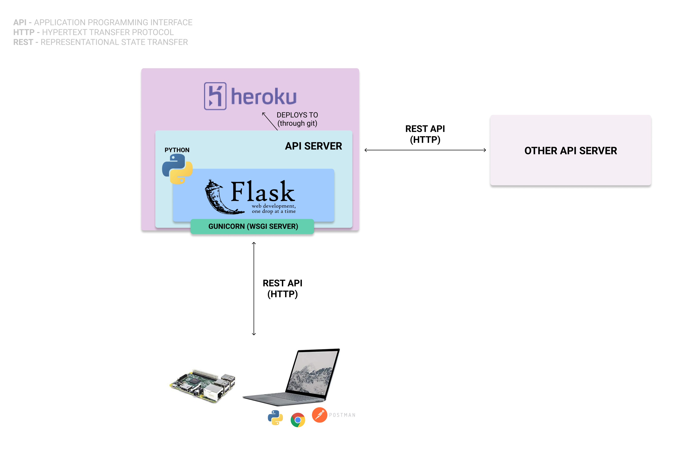

# RESTful API Server Implementation Example

Tutorial and implementation example of implementing a RESTful API Server in Python. This is primarily designed to be a starter for implementing value-added applications for Iotery.



The video can be found [here](https://vimeo.com/350646693).

## Setting up

Clone the repository:

```
git clone https://gitlab.com/systems-iot/api-server-implementation.git
```

Once you have cloned the repository, `cd` into `api-server-implementation` and set up your virtualenv:

```
virtualenv venv
```

Activate your virtual environment:

```
source venv/bin/activate
```

> On Windows, you will want to run the `activate.bat` file in the `venv/Scripts` folder to activate your environment.

Lastly, you will need to install the dependencies:

```
pip install -r requirements.txt
```

## Running the server

Make sure you have your virtual environment active, and run

```
python app.py
```

You can visit [http://localhost:5000/hello/me](http://localhost:5000/hello/me) in your browser and should see

```json
{ "hello": "me" }
```
